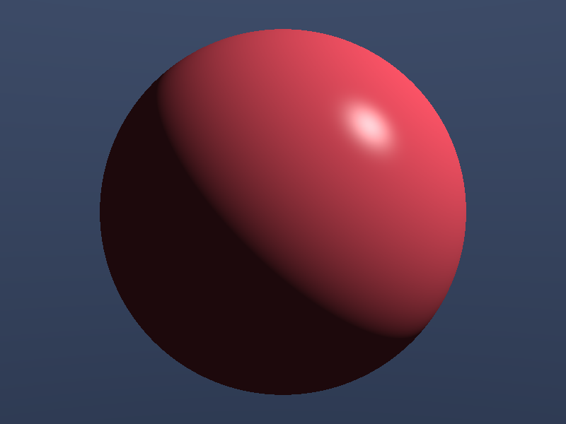
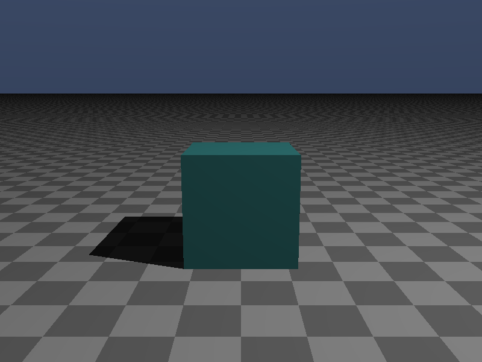
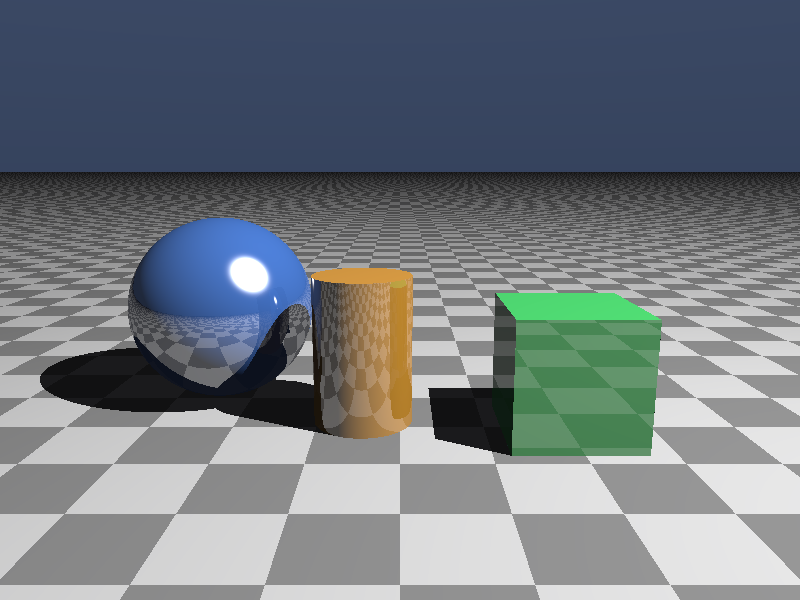
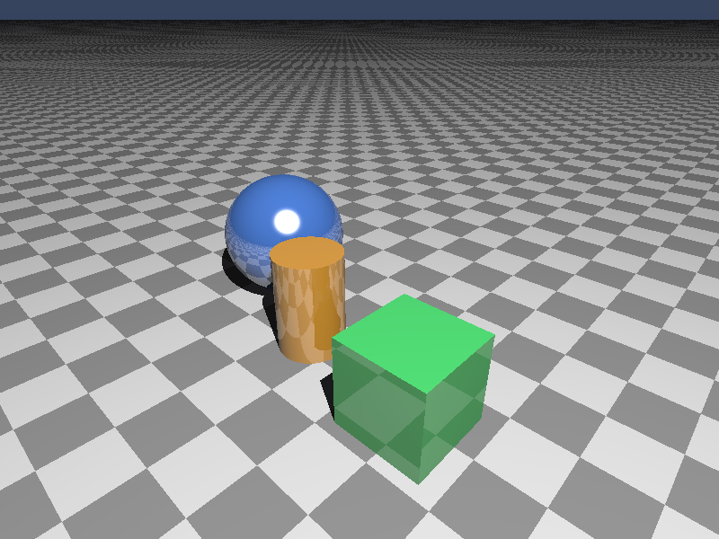

# 🌌 RayCraft3D

[](https://www.rust-lang.org/)
[](#-system-architecture)
[](LICENSE.md)

**RayCraft3D** is a high-performance, concurrent 3D ray tracing rendering engine implemented in pure Rust. Built without external math or rendering crates, RayCraft3D features custom vector math operations, multithreaded row-parallel rendering using CPU-scoped threads, Blinn-Phong shading, direct shadows, recursive reflections, Snell's law refractions, and procedural textures.

---

## ⚡ Key Highlights

- **Pure Rust Math Engine**: Overloaded custom 3D vector operations (`Vec3`), matrix transformations, normal calculations, and lighting functions without external crate dependencies.
- **Multithreaded Parallel Renderer**: Leverages modern CPU-scoped threads (`std::thread::scope`) to dynamically split viewport row calculations across available CPU cores.
- **Advanced Optical Shading**: Implements Blinn-Phong specular highlights, Lambertian diffuse lighting, ambient lighting, and ray-traced direct shadows.
- **Reflections & Glass Refractions**: Supports metallic mirror surfaces and glass element refractions using Fresnel's Schlick Approximation.
- **Procedural Textures & Wave Fluids**: Procedural checkerboard textures for floor planes and sinusoidal normal vector perturbations for liquid surfaces.
- **Custom Scene Parser (`.rt`)**: Scene loader allowing configuration of eye positions, look-at targets, point lights, planes, spheres, cubes (AABB), and cylinders.

---

## 📋 Table of Contents

- [Key Highlights](#-key-highlights)
- [System Architecture](#-system-architecture)
- [Ray Trace Pipeline Sequence](#-ray-trace-pipeline-sequence)
- [Scene Configuration Format](#-scene-configuration-format)
- [Setup & Execution](#-setup--execution)
- [Project Directory Structure](#-project-directory-structure)
- [License](#-license)

---

## 🖼️ Ray-Traced Showroom Renders

| Scene 1: Multi-Sphere Lighting | Scene 2: Mirror Reflections |
| :---: | :---: |
|  |  |

| Scene 3: Glass Refraction & Solids | Scene 4: Wave Fluid & Textures |
| :---: | :---: |
|  |  |

---

## 🏗️ System Architecture

```mermaid
graph TD
    A[CLI Bootstrapper - main.rs] --> B{Scene Source?}
    B -->|Flag --scene 1..4| C[Built-in Showroom Generator]
    B -->|Flag --file scene.rt| D[Scene Configuration Parser]
    
    C --> E[Renderer Core - renderer.rs]
    D --> E
    E --> F[Parallel Thread Coordinator: std::thread::scope]
    
    F --> G[Ray Trace Worker Core]
    G --> H1[Intersection Engine: Sphere, Plane, Cube, Cylinder]
    G --> H2[Shading Engine: Blinn-Phong & Direct Shadows]
    G --> H3[Optical Engine: Recursive Reflection & Refraction]
    
    H1 --> I[Pixel Color Calculation & Gamma Correction]
    H2 --> I
    H3 --> I
    I --> J[PPM Output Stream Writer - ppm.rs]
```,StartLine:33,TargetContent:

---

## 📐 Ray Trace Pipeline Sequence

```mermaid
sequenceDiagram
    participant CLI as CLI Controller
    participant Thread as Scoped Thread Workers
    participant Ray as Ray Engine
    participant Object as Geometry Intersector
    participant Light as Shading & Lighting

    CLI->>Thread: Spawn N threads for Y-range pixel rows
    loop For Each Pixel (x, y)
        Thread->>Ray: Primary Camera Ray (Eye -> Viewport Pixel)
        Ray->>Object: Find Closest Intersection (Sphere/Plane/Cube/Cylinder)
        alt Ray Hits Surface
            Object-->>Ray: Intersection Point & Normal Vector
            Ray->>Light: Cast Shadow Rays to Point Lights
            alt In Direct Light
                Light-->>Ray: Add Diffuse + Specular Intensity
            else In Shadow
                Light-->>Ray: Apply Ambient Light Only
            end
            opt Material Reflective / Refractive
                Ray->>Ray: Recurse Secondary Ray (Fresnel Schlick Blend)
            end
        else No Intersection
            Ray-->>Thread: Return Gradient Sky Background
        end
        Thread->>Thread: Write Gamma-2 Corrected Color to PPM Buffer
    end
    Thread-->>CLI: Combine Thread Rows -> Output P3 PPM Image File
```

---

## ⚙️ Scene Configuration Format (`.rt`)

Scenes can be defined using `.rt` text files:

```text
camera 2.8 2.0 -1.0  0.0 -0.1 -4.0  50.0
ambient 0.15 0.15 0.15
light 4.0 6.0 -1.0  1.5  1.0 1.0 1.0

# sphere: cx cy cz radius r g b specular reflective refractive transparency
sphere -1.6 -0.2 -4.2  0.8  0.1 0.3 0.9  50.0 0.3 1.0 0.0

# plane: px py pz nx ny nz r g b specular reflective [checker_freq c2_r c2_g c2_b]
plane 0.0 -1.0 0.0  0.0 1.0 0.0  0.3 0.3 0.3  10.0 0.2  1.5 0.7 0.7 0.7

# cube: min_x min_y min_z max_x max_y max_z r g b specular reflective
cube -0.5 -1.0 -4.0  0.5 0.0 -3.0  0.2 0.8 0.2  20.0 0.1
```

---

## 🚀 Setup & Execution

### Prerequisites

- **Rust**: Cargo and `rustc` (1.70+) installed.

---

### Build & Run

1. **Clone Repository**:
   ```bash
   git clone https://github.com/sahmedhusain/raycraft-3d.git
   cd raycraft-3d
   ```

2. **Compile Release Binary**:
   ```bash
   cargo build --release
   ```

3. **Render Built-in Showroom Scene**:
   ```bash
   # Basic Shading (Scene 3):
   cargo run --release -- --scene 3 > scene3.ppm

   # High-Quality Premium (Textures, Reflections/Refractions, Particles, Fluids):
   cargo run --release -- --scene 3 -t -r -p -f > scene3_premium.ppm
   ```

4. **Render Custom Scene File**:
   ```bash
   cargo run --release -- --file scene.rt.example -t -r -p -f > custom_render.ppm
   ```

---

## 📂 Project Directory Structure

```
raycraft-3d/
├── Cargo.toml            # Rust package manifest (name: raycraft-3d)
├── scene.rt.example      # Sample scene configuration file
├── README.md             # Documentation
└── src/
    ├── main.rs           # CLI argument parser and execution coordinator
    ├── renderer.rs       # Multithreaded scoped ray trace loop and shading engine
    ├── scene.rs          # Built-in scene generators and .rt file loader
    ├── object.rs         # Geometry intersection math (Sphere, Plane, Cube, Cylinder)
    ├── material.rs       # Material properties, Fresnel equations, & checker textures
    ├── camera.rs         # Rotatable 3D camera viewport mapper
    ├── light.rs          # Point light source definitions
    ├── vec3.rs           # Custom overloaded 3D vector math operations
    └── ppm.rs            # ASCII P3 PPM image formatter with gamma correction
```

---

## 📄 License

Distributed under the MIT License. See [LICENSE](LICENSE.md) for details.