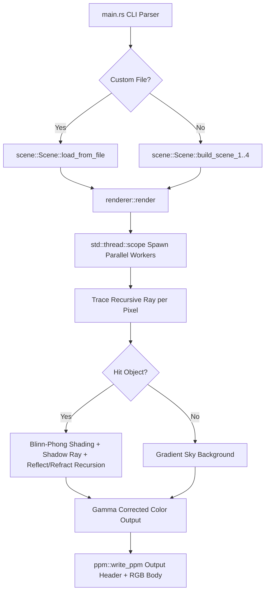

# rt (Ray Tracer) 🌌

[](https://www.rust-lang.org/)
[](#-architecture)
[](LICENSE.md)

<p align="center">
	
	
</p>


A high-performance, concurrent 3D **Ray Tracer (rt)** implemented in Rust. It supports rendering standard geometric shapes, lighting, shadows, and optional recursive reflections/refractions, surface textures, particles, and fluids behind performance flags.

## ⚡ Highlights

- **Pure Rust Math**: Overloaded custom 3D vector logic and lighting calculations without external crates.
- **Concurrent Execution**: Multi-threaded rendering using modern scoped threads (`std::thread::scope`) dynamically dividing rows across CPU cores.
- **Ray-Traced Shadows**: Casts accurate, direct shadows from point lights onto surrounding surfaces.
- **Reflections & Glass Refractions**: Mirrors and glass elements with Fresnel's Schlick Approximation blend.
- **Procedural Textures & Wave Map Fluids**: Grid textures and wavy liquid normal vector perturbations.

## 📋 Table of Contents

- [Highlights](#-highlights)
- [Key Features](#-key-features)
- [Built-in Scenes](#-built-in-scenes)
- [Screenshots](#-screenshots)
- [Custom Scene Configuration](#%EF%B8%8F-custom-scene-configuration)
- [Code Examples (Internals)](#-code-examples-internals)
- [Architecture](#-architecture)
- [Run It Locally](#-run-it-locally)
- [Project Structure](#-project-structure)
- [Authors](#-authors)

---

## ⭐ Key Features

1. **Four Core Geometries**: Sphere, Plane, Cube (AABB), and capped Cylinder with fully rotatable normals.
2. **Projective Camera Model**: Fully rotatable and movable camera with custom Field of View (FOV) and viewport mapping.
3. **Advanced Shading & Lighting**: Blinn-Phong specular highlights, Lambertian diffuse lighting, ambient settings, and ray-traced shadows.
4. **Recursive Reflections & Refractions**: Realistic metallic mirrors and refractive glass utilizing Snell's Law (enabled via `-r` flag).
5. **Procedural Textures**: Checkerboard texturing for planes and shapes (enabled via `-t` flag).
6. **Deterministic Sparkles (Particles)**: Tiny, golden-glowing dust particles procedurally scattered using a deterministic seed (enabled via `-p` flag).
7. **Refractive Fluids**: Wavy liquid surfaces with sinusoidal normal vector perturbation (enabled via `-f` flag).

## 🧭 Quick Tour

- **Scene selection**: Directly switch built-in scenes using the CLI (`--scene 1-4`).
- **Custom Scene Parser**: Dynamically load text-based `.rt` files (`--file <path>`).
- **Flexible Dimensions**: Easily control width and height parameters (`--width <px> --height <px>`).

<p align="center">
	
</p>

## 📸 Built-in Scenes

To satisfy project audit criteria, the ray tracer contains 4 built-in configurations. Run these commands to output standard PPM images:

### Scene 1: Single Sphere
*A shiny red sphere showing specularity and ambient light.*
```bash
cargo run --release -- --scene 1 > scene1.ppm
```

### Scene 2: Low-Brightness Cube
*A matte cyan cube sitting on a floor, illuminated with a low-brightness light source.*
```bash
cargo run --release -- --scene 2 > scene2.ppm
```

### Scene 3: Complete Objects Showroom
*A showroom containing a flat floor plane, a shiny blue sphere, a glossy green cube, and a shiny orange cylinder.*
```bash
# Basic Shading:
cargo run --release -- --scene 3 > scene3.ppm

# With Textures:
cargo run --release -- --scene 3 -t > scene3_textured.ppm

# Premium (Textures, Reflections/Refractions, Particles, Fluids):
cargo run --release -- --scene 3 -t -r -p -f > scene3_premium.ppm
```

### Scene 4: Alternate Camera Perspective
*The exact showroom of Scene 3 viewed from a high-angle camera coordinate.*
```bash
cargo run --release -- --scene 4 -t -r -p -f > scene4.ppm
```

---

## 🖼 Screenshots

*Placeholders for the rendered scenes. You can replace these images with your actual rendered screenshots once generated.*

<div align="center">
	<table>
		<tr>
			<td align="center" width="50%">
				
				<p><strong>Scene 1: Single Sphere</strong></p>
			</td>
			<td align="center" width="50%">
				
				<p><strong>Scene 2: Low-Brightness Cube</strong></p>
			</td>
		</tr>
		<tr>
			<td align="center" width="50%">
				
				<p><strong>Scene 3: Complete Showroom</strong></p>
			</td>
			<td align="center" width="50%">
				
				<p><strong>Scene 4: Alternate Camera Perspective</strong></p>
			</td>
		</tr>
	</table>
</div>

---

## 🛠 Tech Stack

- **Rust**: Language of implementation (2024 edition).
- **Multi-threading (Standard Library)**: Dynamic workload distribution using CPU-scoped threads.
- **PPM Image Format**: Lossless ASCII P3 output stream.

## 🏗 Architecture



---

## ⚙️ Custom Scene Configuration (`.rt`)

You can create custom scenes by using a `.rt` configuration file. The ray tracer provides an example template file named `scene.rt` in the project root.

### Copying and Customizing Scenes

To create a new custom scene file, you can copy the template. You can use the following command to duplicate it while **removing all comment lines (`#`)** to keep the file clean:

```bash
grep -v '^#' scene.rt.example > my_custom_scene.rt
```

### Running Your Custom Scene

To run the ray tracer with your custom scene file and activate all premium rendering (reflections, refractions, textures, fluids, and particles):

```bash
cargo run --release -- --file my_custom_scene.rt -t -r -p -f > custom_render.ppm
```

### Custom Scene Syntax

| Command | Syntax | Description |
| :--- | :--- | :--- |
| **camera** | `camera eye_x eye_y eye_z look_x look_y look_z fov` | Sets the camera position, target point, and Field of View (FOV). |
| **ambient** | `ambient r g b` | Sets the color and intensity of global ambient lighting. |
| **light** | `light x y z intensity r g b` | Creates a point light source with intensity and light color. |
| **sphere** | `sphere cx cy cz radius r g b specular reflective refractive transparency` | Adds a sphere with radius, color, specular highlight, reflectivity coefficient, index of refraction, and transparency coefficient. |
| **plane** | `plane px py pz nx ny nz r g b specular reflective [checker_freq c2_r c2_g c2_b]` | Adds an infinite flat plane with a point, a normal vector, color, specular, reflectivity. Optionally, append checker scale and a second color for procedural checkers. |
| **cube** | `cube min_x min_y min_z max_x max_y max_z r g b specular reflective` | Adds a cube defined by its minimum and maximum bounding corners. |
| **cylinder** | `cylinder cx cy cz radius height r g b specular reflective` | Adds a capped, Y-oriented cylinder. |

---

## 💻 Code Examples (Internals)

### 1. Shape Instantiation

All objects implement the `Intersect` trait. You can construct them with a designated `Material`:

```rust
// A shiny, 30% reflective blue sphere
let sphere_mat = Material::shiny(Vec3::new(0.1, 0.3, 0.9), 0.3);
let sphere = Sphere::new(
    Vec3::new(-1.6, -0.2, -4.2), // Position (Center)
    0.8,                         // Radius
    sphere_mat
);

// An infinite flat plane with a procedural checkerboard pattern
let plane_mat = Material::checker(
    Vec3::new(0.3, 0.3, 0.3),    // Primary gray
    Vec3::new(0.7, 0.7, 0.7),    // Secondary white
    1.5                          // Scale/Frequency
);
let plane = Plane::new(
    Vec3::new(0.0, -1.0, 0.0),   // Point on plane
    Vec3::new(0.0, 1.0, 0.0),    // Normal vector pointing UP
    plane_mat
);
```

### 2. Shading & Brightness Control

The brightness of a scene can be controlled globally using the ambient light vector or on individual light sources:

```rust
// Define ambient light in the Scene struct
let ambient_light = Vec3::new(0.15, 0.15, 0.15); // Moderate ambient brightness

// Configure direct point light intensities
let bright_light = Light::new(
    Vec3::new(4.0, 6.0, -1.0),
    1.5,                                         // High intensity (1.5)
    Vec3::new(1.0, 1.0, 1.0)
);

let dim_light = Light::new(
    Vec3::new(-3.0, 3.0, -2.0),
    0.4,                                         // Low intensity (0.4)
    Vec3::new(1.0, 1.0, 1.0)
);
```

### 3. Camera Positioning

The `Camera` is fully configurable with view vectors computed relative to its look-at target:

```rust
let camera = Camera::new(
    Vec3::new(2.8, 2.0, -1.0),     // Camera Position (Eye)
    Vec3::new(0.0, -0.1, -4.0),    // Target Point (Look At)
    Vec3::new(0.0, 1.0, 0.0),      // Up Vector
    50.0,                          // Field of View in degrees
    aspect_ratio,                  // Viewport width / height
);
```

---

## 🚀 Run It Locally

### Prerequisites
Make sure you have [Rust and Cargo](https://rustup.rs/) installed.

```bash
# Clone the repository
git clone <repository_url>
cd rt

# Verify compilation
cargo check
```

### Running and Viewing Output
Render standard Scene 3 with all flags enabled at `800x600`:
```bash
cargo run --release -- --scene 3 -t -r -p -f > output.ppm
```

To render a preview **almost instantly** (e.g. `160x120` for quick development checking):
```bash
cargo run -- --scene 3 --width 160 --height 120 -t -r -p -f > preview.ppm
```

---

## 📁 Project Structure

- `Cargo.toml` — Rust project configuration and dependencies.
- `scene.rt` — Documented custom scene file template.
- `src/` — Ray tracer source files:
  - `main.rs` — CLI parser and execution controller.
  - `renderer.rs` — Scoped threads parallelism, recursive ray-casting loop, and shading calculations.
  - `scene.rs` — Built-in scenarios and `.rt` file line loader.
  - `object.rs` — Geometries collision equations (Sphere, Plane, Cube, Cylinder).
  - `material.rs` — Surface reflections, glass refraction coefficients, and procedural textures.
  - `camera.rs` — Rotatable camera viewport math.
  - `light.rs` — Point light source intensity and colors.
  - `vec3.rs` — Custom overloaded 3D vector operations.
  - `ppm.rs` — ASCII P3 image builder with gamma-2 correction.

---

## 👥 Authors

- Sayed Ahmed Husain — sayedahmed97.sad@gmail.com

MIT licensed (see `LICENSE.md`). Happy ray tracing!